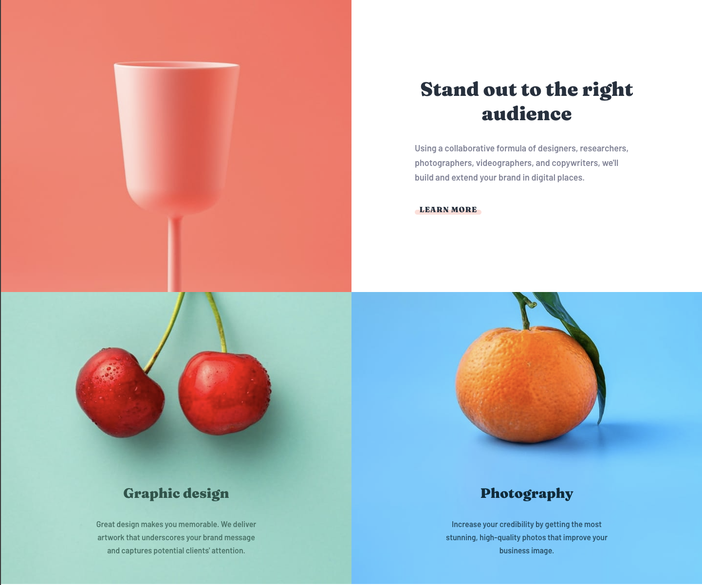
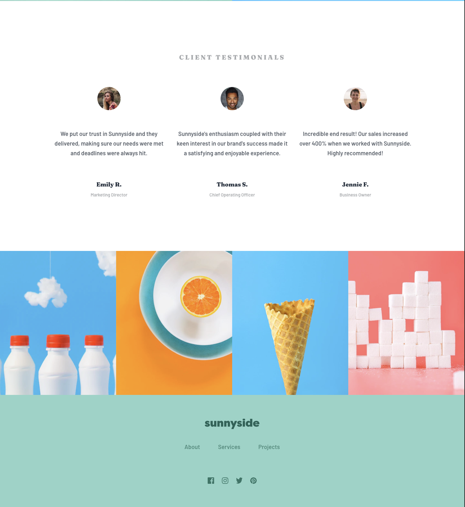

# Agency Landing Page

## Table of contents

- [Overview](#overview)
  - [Screenshot](#screenshot)
  - [Links](#links)
- [My process](#my-process)
  - [Built with](#built-with)
- [Author](#author)

## Overview

### Screenshot

### Links

- Solution URL: [Solution URL](https://github.com/kisu-seo/agency_landing_page)
- Live Site URL: [Live URL](https://kisu-seo.github.io/agency_landing_page/)

## My process

### Built with

- **Semantic HTML5 Markup** - `<header>`, `<main>`, `<section>`, `<article>`, `<footer>` for meaningful document structure

- **CSS Custom Properties (Variables)** - Centralized design tokens in :root for colors, fonts, and spacing

- **BEM Methodology** - Block Element Modifier naming convention (e.g., .feature__content, .navigation__link--cta)

- **CSS Grid Layout** - Used for the alternating "checkerboard" layout (image/text) and the 4-column gallery grid

- **Flexbox Layout** - utilized for the navigation bar, content centering, and testimonial alignment

- **Responsive Images** - `<picture>` element with `<source>` tags for "Art Direction" (switching between mobile/desktop image crops)

- **Mobile-First Workflow** - Styles developed for mobile first, then adapted for Tablet (768px) and Desktop (1024px)

- **Vanilla JavaScript (ES6+)** - Pure DOM manipulation without libraries or frameworks

- **Performance Optimization** - Debounce technique implemented (resize-animation-stopper) to prevent layout thrashing during resize

- **Accessibility (a11y)** - ARIA attributes (aria-expanded, aria-label, aria-hidden) for screen reader support

- **Google Fonts** - Barlow (Sans-serif, 600) & Fraunces (Serif, 700/900)

- **Smooth Transitions** - Hover effects on buttons and navigation links, with a fix for resize-induced flickering

## Author

- Website - [Kisu Seo](https://github.com/kisu-seo)
- Frontend Mentor - [@kisu-seo](https://www.frontendmentor.io/profile/kisu-seo)
